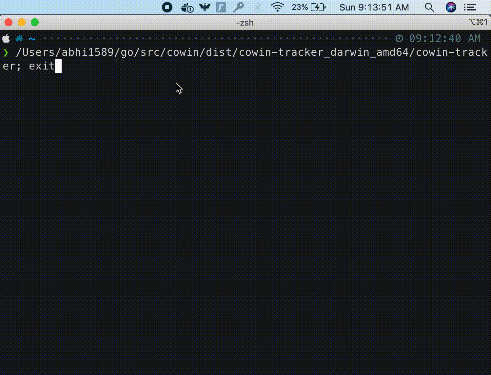

# CoWIN Vaccine Slot Availability Tracker

A simple cross platform CoWIN ( COVID-19 ) India Vaccine Slot Availability Tracker

**The goal here is to keep it simple so that more people can use it and get vaccinated.**

> Please make sure **DO NOT DISTURB** is turned **off** on your system to get notifications.

## Features

- ✅ Supports Windows, Mac, Linux.
- ✅ Easy to use and setup.
- ✅ No Pre-Configuration Required.
- ✅ System notification as soon as Vaccine slot is avaiable.
- ✅ Allow you to select scan date and days to scan.
- ❌ Auto Booking ( Please visit CoWin website once you get notification ).

  
## Installation 

Download the zip based on your system.

**Windows Download:**

* [Windows x64](https://github.com/abhimanyu003/cowin-tracker/releases/download/v0.1.0/cowin-tracker_0.1.0_windows_amd64.zip)
* [Windows x86](https://github.com/abhimanyu003/cowin-tracker/releases/download/v0.1.0/cowin-tracker_0.1.0_windows_386.zip)

Extract the zip and run `cowin-tracker.exe`

**Mac:**

* [Mac x64](https://github.com/abhimanyu003/cowin-tracker/releases/download/v0.1.0/cowin-tracker_0.1.0_darwin_amd64.tar.gz)

Extract zip and run `cowin-tracker`

**Linux:**

* [Linux x64](https://github.com/abhimanyu003/cowin-tracker/releases/download/v0.1.0/cowin-tracker_0.1.0_linux_amd64.tar.gz)
* [Linux x86](https://github.com/abhimanyu003/cowin-tracker/releases/download/v0.1.0/cowin-tracker_0.1.0_linux_386.tar.gz)

Extract zip and run `cowin-tracker`

To see all releases [visit here](https://github.com/abhimanyu003/cowin-tracker/releases)

## Demo

  
## Authors

- [@abhimanyu003](https://www.github.com/abhimanyu003)
- [@kshitijmehta](https://github.com/kshitijmehta)

  
## Acknowledgements

Thanks to API providers:

 - [API Setu](https://apisetu.gov.in/public/api/cowin)
 - [CoWin Gov](https://www.cowin.gov.in/)
  
## License

"THE BEERWARE LICENSE"

You can do whatever you want with this stuff. If we meet some day, and 
you think this stuff is worth it, you can buy me/us a beer in return.

  
